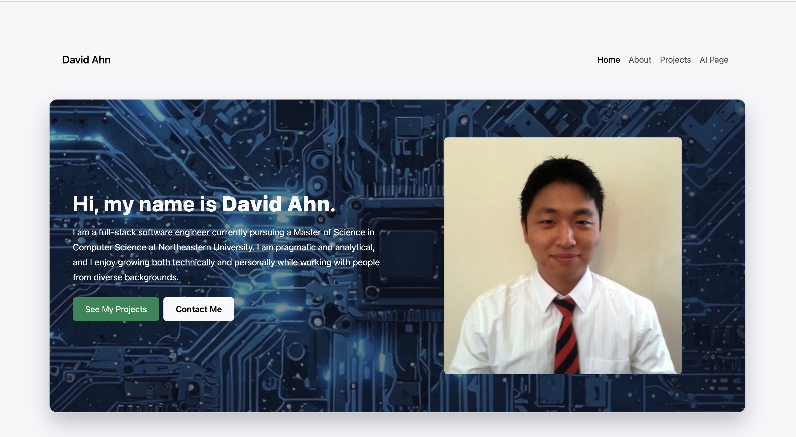
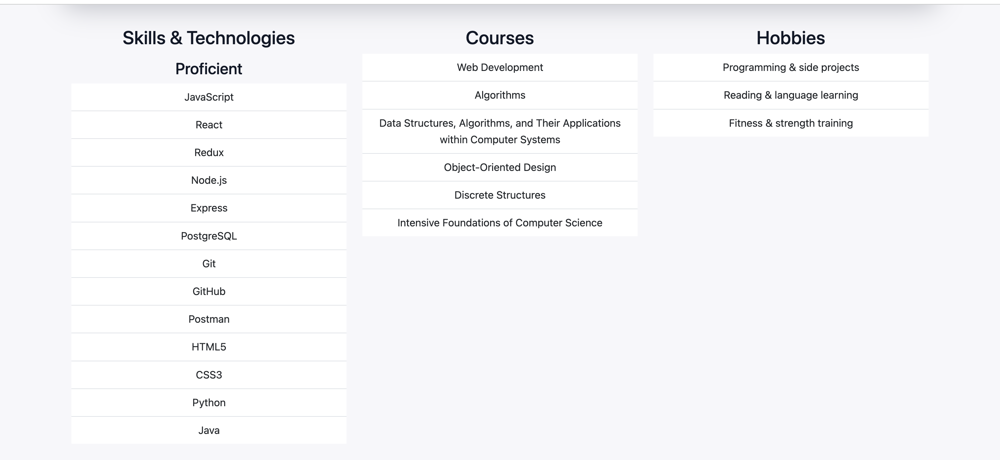
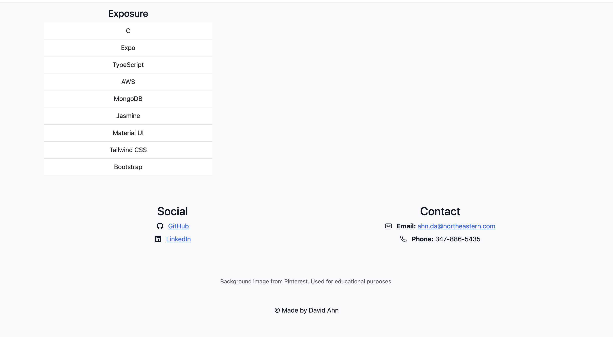
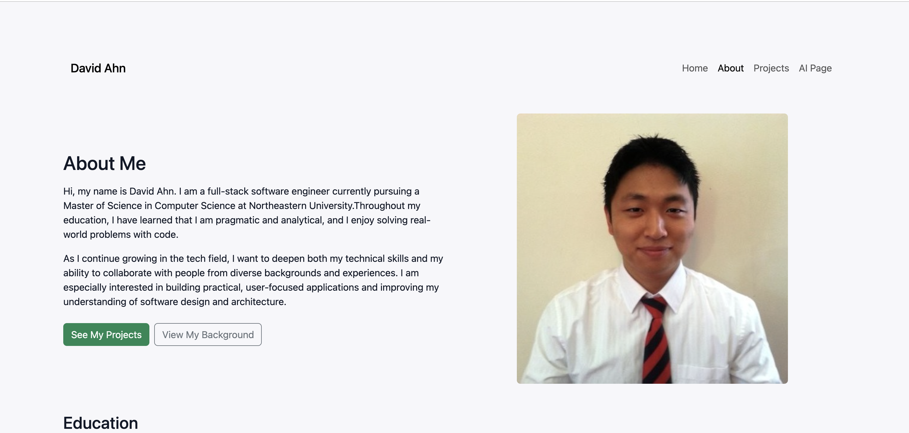
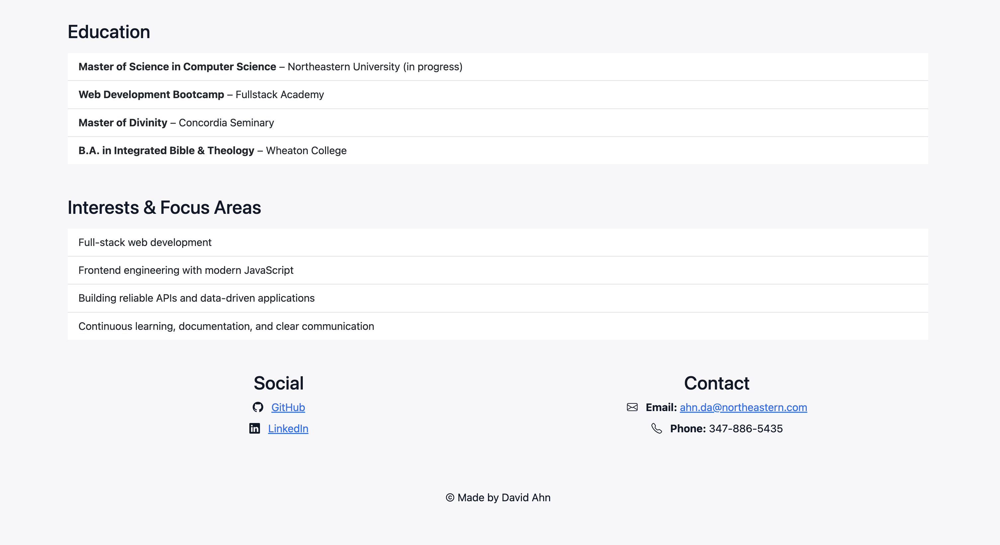
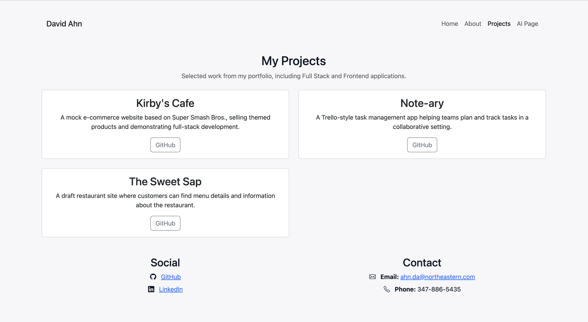
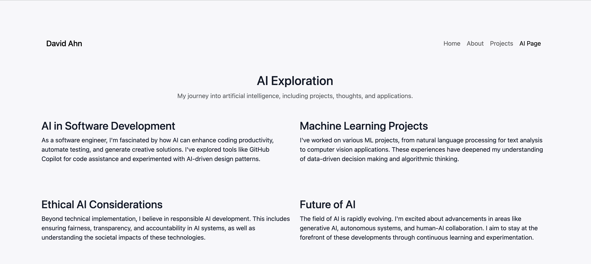
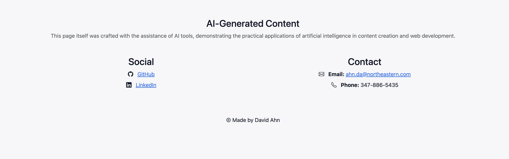

# David Ahn – Personal Homepage (Project 1)

A personal website showcasing my background, projects, and contact information using **HTML5, CSS3, Bootstrap 5, and vanilla JavaScript (ES modules)**.

---

## Live Demo

* **GitHub Pages:** [https://dahn0209.github.io/David_Ahn_personal_Website/](https://dahn0209.github.io/David_Ahn_personal_Website/)

---

## Screenshots

### Homepage





### About Page




### Projects Page



### AI Page




---

## Project Objective

The goal of this project is to create a W3C-compliant personal homepage that:

* Highlights my **skills, courses, and hobbies**
* Presents my **full-stack projects** with GitHub links
* Includes **vanilla JavaScript features**
* Uses **Bootstrap 5** for responsive layout
* Includes an **AI-assisted page** explaining my interest in AI and how I used AI tools in this project

---

## Features

* **Responsive Layout**

  * Built with Bootstrap 5 grid and utility classes
  * Looks good on desktop, tablet, and mobile

* **Data-Driven Content with Vanilla JavaScript**

  * `Skills & Technologies` rendered from `js/data/skills.js`
  * `Courses` rendered from `js/data/courses.js`
  * `Projects` page rendered from `js/data/projects.js`
  * Uses ES modules (`import/export`) and DOM manipulation

* **Multiple Pages**

  * `index.html` – intro, skills, courses, hobbies, contact
  * `about.html` – background, education, interests
  * `projects.html` – portfolio cards with GitHub links
  * `ai-page.html` – AI exploration page

* **Navigation Highlight**

  * `js/components/nav.js` highlights the current page in the navbar

* **Accessibility and Compliance**

  * Semantic HTML (`header`, `footer`, `section`)
  * `alt` attributes on all images
  * Passes W3C HTML validation

---

## Tech Stack

* **Frontend**

  * HTML5
  * CSS3 (`./css/main.css`)
  * Bootstrap 5
  * Bootstrap Icons

* **JavaScript**

  * Vanilla JS (ES6+)
  * ES modules for navigation highlighting and data rendering

* **Tooling**

  * ESLint 9 (`eslint.config.mjs`)
  * Prettier
  * Node.js + npm (dev tooling only)

---

## Getting Started

### Prerequisites

* A modern web browser
* **Node.js and npm** (required to run a local development server or dev tools)

Download Node.js from: [https://nodejs.org/](https://nodejs.org/)

---

### Clone the Repository

```bash
git clone https://github.com/dahn0209/David_Ahn_personal_Website.git
cd David_Ahn_personal_Website
```

---

### Install Packages

Install project dependencies (dev tooling such as ESLint and Prettier):

```bash
npm install
```

---

### Run the Site Locally with `http-server`

Because this project uses **JavaScript ES modules**, it should be served over HTTP rather than opened directly with `file://`.

#### Install `http-server` (one-time setup)

```bash
npm install -g http-server
```

#### Start the local server

From the project root:

```bash
http-server
```

Open the site in your browser at:

```text
http://localhost:8080
```

---

