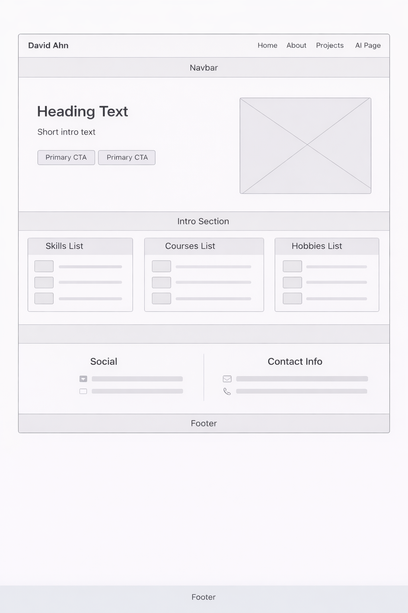
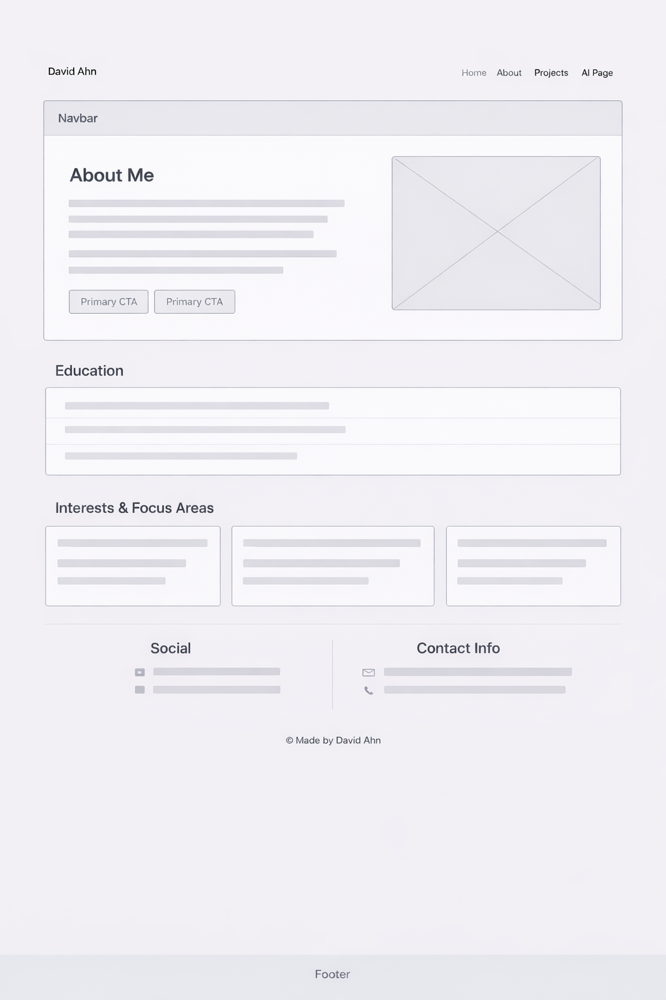
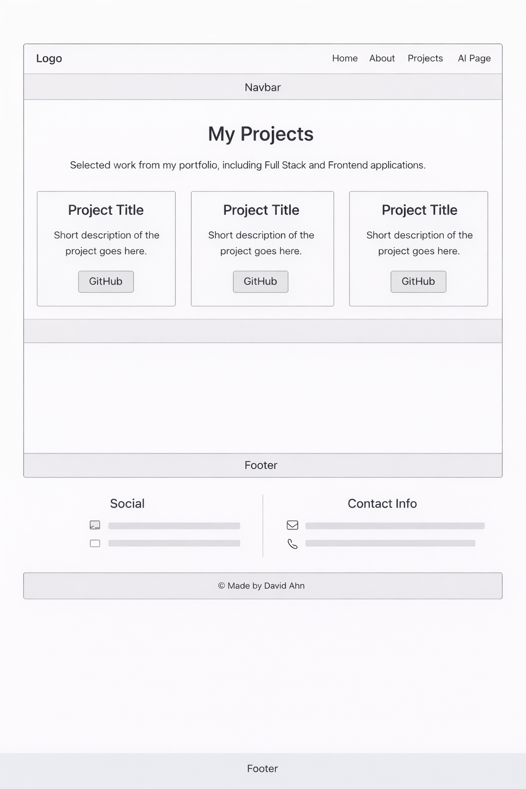
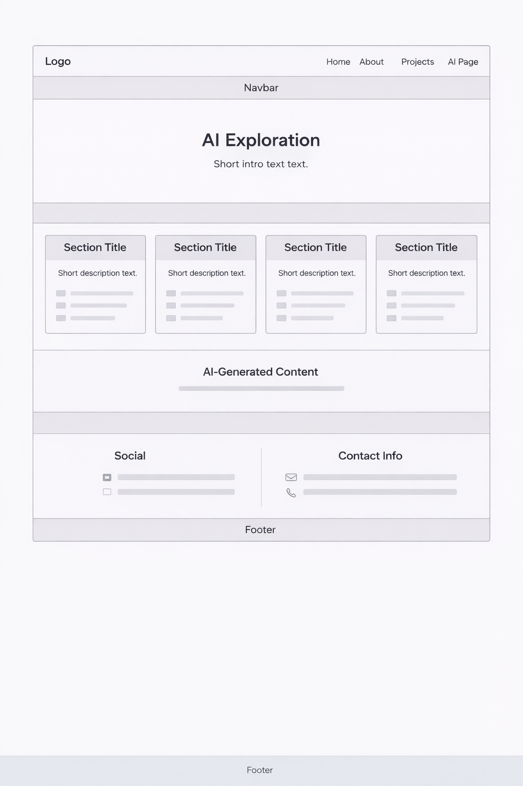

# Design Document — David Ahn Personal Homepage 

## Project Description

 The goal of the Personal Homepage site is to present a professional online portfolio using **vanilla HTML5, CSS3, Bootstrap 5, and ES6 JavaScript modules**, 

The website serves as a portfolio homepage that highlights:

- Personal background and education  
- Technical skills and coursework  
- Selected software projects with GitHub links  
- An AI focused page explaining interest in artificial intelligence and the use of generative AI tools  

The site is static that is deployed in GitHub, and emphasizes clean structure, accessibility, responsiveness, and maintainable code organization.

---

## User Story

### Person 1: Recruiter / Hiring Manager

**Name:** Alex Martinez  
**Role:** Technical Recruiter  

**Goals:**

- Understand the candidate’s background and skill set  
- View projects and source code links  
- Assess professionalism and clarity of presentation  

**Needs:**

- Clear navigation  
- Concise summaries of skills and experience  
- Easy access to GitHub and LinkedIn  
 

---

### Person 2: Computer Science Student / Peer

**Name:** Jordan Lee  
**Role:** CS Student  

**Goals:**

- Explore project ideas and implementations  
- Learn how to structure a static site using vanilla JavaScript  
- Understand how ES modules can be used without frameworks  

**Needs:**

- Readable code structure  
- Clear separation of data and rendering logic  
- Well organized folder structure  

---

## User Stories

### User Story 1: Recruiter

> As a recruiter, I want to view a candidate’s skills and projects to see if they are a good fit for an open role.

Alex visits the homepage and sees a brief introduction, an organized section for skills, courses, and projects. Alex navigates to the Projects page to review GitHub links and assess code quality.

---

### User Story 2: Student Peer

> As a fellow student, I want to explore how the site is built because I want to learn how to structure websites using vanilla JavaScript and ES modules.

Jordan explores the Projects page and inspects the repository. Jordan notices the separation between data files and rendering logic, which makes the project easier to understand and extend.

---

### User Story 3: Visitor Interested in AI

> A visitor interested in artificial intelligence, wants to understand how AI tools were used in the project and how the author thinks about AI.

The visitor navigates to the AI page and reads about AI assisted development, ethical considerations, and the author’s interests in AI related topics.

---

## Design Mockups / Wireframes (Figma)

All page layouts used **Figma**, for organization and then implemented in HTML/CSS/Bootstrap based on those wireframes. This helps with visual hierarchy, prominent headings, and  organization

### Homepage Wireframe

The layout has a hero section with background image, intro text, and CTA buttons, and  columns for skills, courses, and hobbies.

### About Page Wireframe

A layout with text on the left and a profile image on the right, with sections for education, interests, and contact and social links.

### Projects Page Wireframe

A project cards with a title, short description, and a button to GitHub.

### AI Page Wireframe

A series of content sections describing AI interests, ML projects, ethical considerations, and AI generated content, which ends with a shared contact/social block.

---

## Final Layout Description

### Homepage (`index.html`)

- **Header:** Navigation bar with links to Home, About, Projects, and AI Page  
- **Intro Section:** Introduction text with a background image and two buttons  
- **Content Sections:**
  - Skills & Technologies 
  - Courses 
  - Hobbies  
- **Contact Section:** GitHub, LinkedIn, email, and phone information  
- **Footer:** Author attribution  

---

### About Page (`about.html`)

- Column layout with text and profile image  
- Education section using Bootstrap list groups  
- Interests and focus areas  
- Social and contact links with Bootstrap icons  

---

### Projects Page (`projects.html`)

- Grid layout using Bootstrap columns  
- Project cards rendered with JavaScript from `js/data/projects.js`  
- Each card includes:
  - Project title  
  - Short description  
  - GitHub link button  

---

### AI Page (`ai-page.html`)

- Informational sections explaining AI interests  
- Discussion of AI tools and ethical considerations  
- Explicit disclosure of generative AI usage  
- Shared contact and social section

---

## Design Principles

- **Clarity:** Content is organized into sections  
- **Responsiveness:** Bootstrap grid ensures usability for all screen sizes  
- **Maintainability:** Data rendering allows easy future expansion  
- **Accessibility:** Semantic HTML,and  `alt` attributes 
- **Simplicity:** No unnecessary libraries or frameworks  

---

## Future Enhancements

- Add filtering or sorting to the Projects page  
- Expand AI page with interactive visualizations  
- Add animations or transitions using CSS  
- Introduce a light and dark theme toggle  
- More icons and images

---

**Author:** David Ahn
